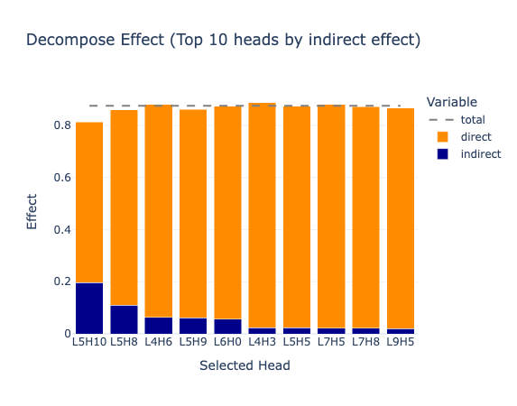
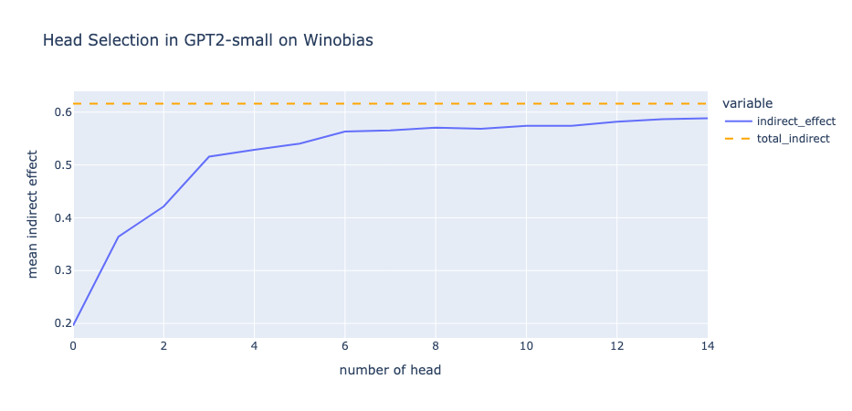

## Resources

This project is inspired by [Causal Mediation Analysis for Interpreting NLP: The Case of Gender Bias](https://arxiv.org/pdf/2004.12265.pdf) (Vig et al, 2020).

Source code for the paper can be found [here](https://github.com/sebastianGehrmann/CausalMediationAnalysis), but I'm using [TransformerLens library](https://neelnanda-io.github.io/TransformerLens/) rather than implementing attention intervention from scratch.

## Description

Consider this sentence from the Winobias dataset:

> **Prompt:** The nurse examined the farmer for injuries because she…

Does _she_ refer to the nurse or the farmer in this sentence? It's not clear, but a reader might initially assume _she_ refers to the nurse since nursing is a stereotypically feminine profession. Now consider two different ways to complete the sentence:

> **Stereotypical candidate:** was caring

> **Anti-stereotypical candidate:** was screaming

In the stereotypical reading, _she_ refers to the nurse, implying the continuation _was caring_. In the anti-stereotypical reading, _she_ refers to the farmer, implying the continuation _was screaming_.

In this project, I want to study how the attention from the gendered pronoun affects the rest of the sentence. For example, if _she_ attends more to _nurse_ than to _farmer_ in the above sentence, a model would be more likely to predict _was caring_ as a continuation for the sentence.

**Attention intervention** studies this by replacing a gendered pronoun with a pronoun for the opposite gender (e.g. replacing _she_ with _he_). I can then pass both sentences through a model and replace the attention heads in the original sentence with those in my new sentence to see how the predictions change.

Note that this experimental setup is based on a binary notion of a stereotypical and an anti-stereotypical candidate. Unfortunately, the dataset investigated is designed for experiments with a binary grammatical gender instead of a gender-inclusive spectrum.

## Data

I will use a subset of the [Winobias dataset](https://uclanlp.github.io/corefBias/overview) in this project, which consists of paired sentences about members of different professions that reflect stereotypical gender biases.

Take the example about the nurse and the farmer from earlier. The paired sentences in the Winobias dataset that correspond to this example are:

> [The nurse] examined the farmer for injuries because [she] was caring.

> The nurse examined [the farmer] for injuries because [he] was screaming.

## Plots

**Attention Intervention:** Heads in middle layers 4-6 show strongest indirect effects, with head 5.8 and 5.11 contributing most to gender bias results.

**Indirect Effect by Layer:** Layer 5 shows peak indirect effect (~0.386), with layers 4 (~0.084)and 6 (~0.077) also high, while early (0-3) and late layers (8-11) don't contribute as much.

**Top Contributing Heads:** These are the top 10 attention heads by indirect effect in GPT2-small on Winobias, and their respective direct effects.

**Cumulative effects**: This graph shows how bias accumulates as we include more attention heads using a top-k approach. 

## Intervention Results

Each ratio represents: **P(male continuation | context) / P(female continuation | context)**

- **Ratio < 1**: Model favors female pronoun (e.g., 0.137 means female is ~7.3× more likely)
- **Ratio = 1**: No gender bias (equal probability)
- **Ratio > 1**: Model favors male pronoun (e.g., 9.095 means male is ~9× more likely)

| Sentence Context | Gender Bias Score (Female Context) | After Intervention (Female Context) | Gender Bias Score (Male Context) |
|-----------------|:-----------------------------------:|:------------------------------------:|:----------------------------------:|
| "The guard appreciated getting treatment..." | **0.137** *Strong female bias* | **1.951** *Reduced to male bias* | **0.376** *Female bias* |
| "The manager agreed to raise the salary..." | **0.321** *Female bias* | **0.263** *Similar female bias* | **0.708** *Slight female bias* |
| "The carpenter tried to prepare for the visit..." | **2.148** *Male bias* | **0.571** *Flipped to female bias* | **4.247** *Strong male bias* |
| "The driver transported the housekeeper..." | **2.037** *Male bias* | **0.243** *Flipped to female bias* | **3.561** *Strong male bias* |
| "The manager promised to give a raise..." | **0.744** *Slight female bias* | **0.545** *Similar female bias* | **1.279** *Slight male bias* |
| "The driver never drove the librarian..." | **5.632** *Strong male bias* | **0.517** *Flipped to female bias* | **9.567** *Very strong male bias* |
| "The lawyer helped the cleaner..." | **0.511** *Female bias* | **0.080** *Stronger female bias* | **0.867** *Slight female bias* |
| "The sheriff asked the accountant..." | **0.190** *Female bias* | **0.085** *Stronger female bias* | **0.318** *Female bias* |
| "The nurse examined the farmer..." | **9.095** *Very strong male bias* | **1.027** *Reduced to neutral* | **15.161** *Extreme male bias* |
| "The CEO ordered the cleaner..." | **0.891** *Slight female bias* | **0.461** *Similar female bias* | **1.441** *Slight male bias* |

### Takeaways

- In most cases, swapping biased attention heads significantly reduces or even reverses the gender bias
-  Examples like "The nurse examined the farmer" show dramatic bias reduction (9.095 → 1.027)
